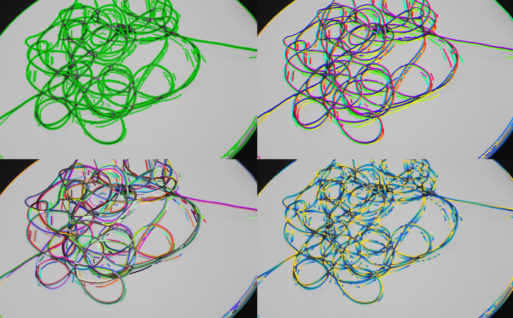
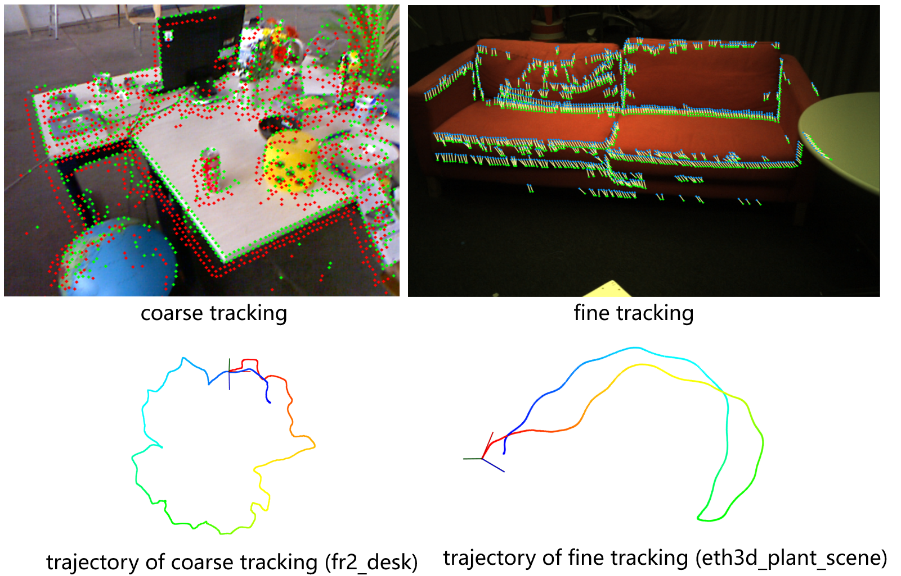
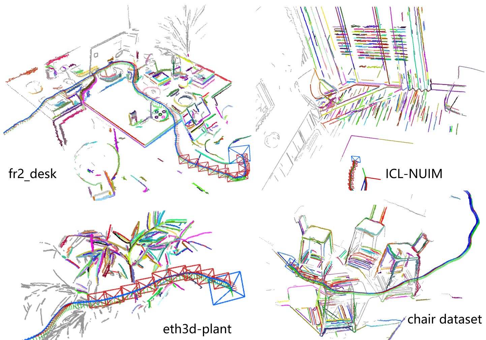
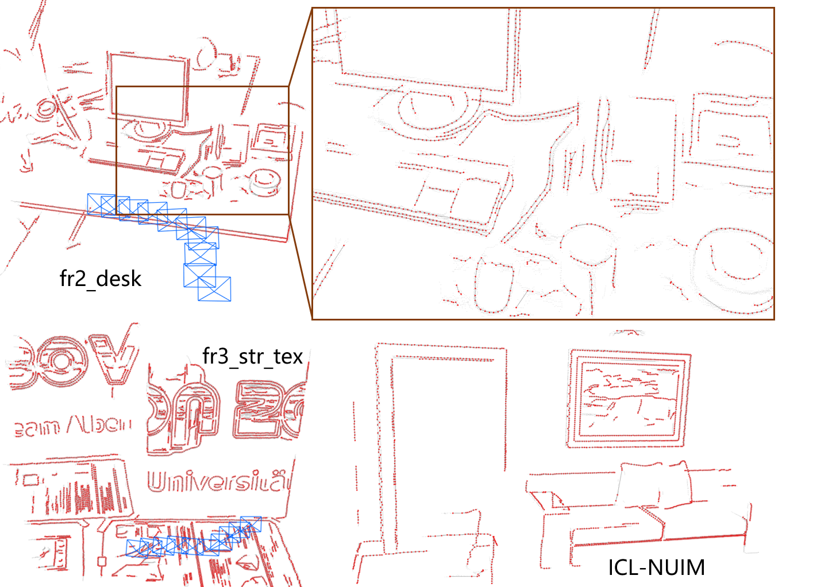

## ROEVO: Robust Organized Edge Feature-based Visual Odometry Using RGB-D Cameras

### 1. Introduction

This repository contains the code implementation for the paper "ROEVO: Robust Organized Edge Feature-based Visual Odometry Using RGB-D  Cameras". It presents a visual odometry system entirely based on a novel feature representation (**organized edge**), aiming to explore the use of  more universal and intuitive geometric features in V-SLAM systems. 

The  repository provides multiple examples to demonstrate the visualization  and quantitative performance of organized edge features in key processes such as feature extraction, tracking, local mapping, multi-frame  association and fusion, and multi-frame optimization. It also offers  test data and interfaces for public datasets.

> The preprint version of the paper is available at: https://ieeexplore.ieee.org/document/11112654

> Portions of the code related to photometric error implementation reference the work from https://www.github-zh.com/projects/145275555-slambook2. We extend our sincere gratitude to the authors for their excellent and systematic contributions.

### 2. Prerequisites

- OpenCV (test with OpenCV 3.4.0)
- PCL (for visualization only)
- Sophus 1.0
- FMT (https://fmt.dev/8.1.1/index.html)
- Pangolin 0.6 (**strict version requirements**. Versions 0.5 or latest are encountering  issues.   *todo*)
- TBB (`sudo apt install libtbb-dev`)

to compile the project, do

```bash
# in any directory: 
git clone https://github.com/liumingrui814/ROEVO.git
cd ROEVO
mkdir build && cd build
cmake ..
make -j16 # your own core number
```

### 3. License

This repository is released under [GPLv3 license](https://github.com/liumingrui814/ROEVO/blob/master/LICENSE). If you find this repository useful in an academic work, please cite:

```
@ARTICLE{roevo,
  author={Liu, Mingrui and Zuo, Xingxing and Huang, Renlang and Zhao, Minglei and Chen, Jiming and Li, Liang},
  journal={IEEE Transactions on Robotics}, 
  title={ROEVO: Robust Organized Edge Feature-Based Visual Odometry Using RGB-D Cameras}, 
  year={2025},
  volume={41},
  number={},
  pages={4860-4880},
  doi={10.1109/TRO.2025.3595702}}
```


### 4. demo & examples

#### (0). * dataset arrangements *

the dataset needs to be organized in the following TUM format: 

```
|data_root
  |-seq_name_1
	|- rgb
		|-- 000.png # file name is the time stamp
		|-- 001.png
		|-- ...
	|- depth
		|-- 000.png
		|-- 001.png
		|-- ...
	|- associates.txt
	|- rgb.txt
	|- depth.txt
  |- seq_name_2
  	|- ....
```

The `associates.txt` file can be generated using the tools provided in the TUM dataset (https://cvg.cit.tum.de/data/datasets/rgbd-dataset/tools).

Configuration YAML files for invoking data sequences are located in the `config` directory. The `pathDataset` parameter in the YAML file should specify the global path to the data_root directory. The YAML file is named according to the sequence name (`seq_name`). To run a specific sequence, assuming the executable is named `exec`, the command would be:

```bash
./exec seq_name
```

Then the code will load the parameter configuration from `config/seq_name.yaml` and execute by reading data from the `pathDataset/seq_name/` directory.

#### (1). feature extraction

This repository provides some example images in the `data` folder. You can visualize the images in the `data` directory by running commands from the `build` folder, for example:

```
./oedge cables.png
```

to visualize the extracted organized edges. You can also modify `examples/testOrganizedEdges.cpp` to visualize any other image.



#### (2). coarse tracking

to run the example of coarse tracking, do

```
./coarse seq_name
```

- You need to create a `seq_name.yaml` file in the `config` directory beforehand.
- The `config` directory contains some existing examples (for example you can go with `./coarse lr_kt0` to run the **lr_kt0** sequence of ICL-NUIM dataset). Modify the `pathDataset` field in these files to point to your own data root directory.
- After finish processing a sequence, the coarse tracking module will save a trajectory file named `poses_coarse.txt` in TUM format under directory  `data_root/seq_name`, which can be used for benchmarking.

#### (3). fine tracking

to run the example of fine tracking, do

```
./fine seq_name
```

- You must have a `poses_coarse.txt` file (generated by running coarse_tracking) as a pose prior to execute fine tracking. Place the `poses_coarse.txt` file in the `data_root/seq_name` directory (i.e., you can first run `./coarse seq_name` followed by `./fine seq_name`).
- The parameters for fine tracking are also located in the `seq_name.yaml` file, prefixed with `fine.`
- After processing a sequence, the fine tracking module will save a trajectory file named `poses_fine.txt` in TUM format under `data_root/seq_name`, which can be used for benchmarking.



#### (4). co-visibility graph

```
./win seq_name
```

- Displays the co-visibility graph maintained by a sliding window, with the viewport visualized using Pangolin.
- You must have a `poses_fine.txt` file (generated by running fine tracking) as a pose prior to execute fine tracking. Place the `poses_fine.txt` file in the `data_root/seq_name` directory



#### (5). local map

```
./lmap seq_name
```

- Displays a local map fused from the co-visibility graph, showing the 3D organized edges after fusion.
- You must have a `poses_fine.txt` file (generated by running fine tracking) as a pose prior to execute fine tracking. Place the `poses_fine.txt` file in the `data_root/seq_name` directory



#### (6). multi-frame optimization

```
./winBA seq_name
```

- Displays a Bundle Adjustment (BA) process based on a sliding window.
- You must have a `poses_fine.txt` file (generated by running fine tracking) as a pose prior to execute fine tracking. Place the `poses_fine.txt` file in the `data_root/seq_name` directory
- After processing a sequence, the fine tracking module will save a trajectory file named `posesKF.txt` in TUM format under `data_root/seq_name`, which can be used for benchmarking.

### 5. Data Examples

#### 1. ICL-NUIM datasets

Downloaded from https://www.doc.ic.ac.uk/~ahanda/VaFRIC/iclnuim.html. Since the filenames in ICL-NUIM‘s association files are **not** timestamps, making it difficult to use TUM's trajectory evaluation tools, this repository also provides a corrected `associates.txt` file with proper timestamps in the `support` folder (scaled based on the **30Hz ** specified on the official website) . Additionally, since ICL-NUIM contains segments without  edge observations, we have extracted several clips for  benchmarking purposes. These results can also be reproduced using the `associates.txt` files provided in the `support` directory.

#### 2. ETH-3D datasets

Downloaded from https://www.eth3d.net/slam_datasets. After downloading both `xxx_mono.zip` and `xxx_rgbd.zip`, extract them into the same folder to run the program. Note that the association file provided by  `xxx_rgbd.zip` is named **associated.txt** and should be renamed to **associates.txt** before execution.

#### 3. TUM-RGBD datasets

Downloaded from https://cvg.cit.tum.de/data/datasets/rgbd-dataset/download. Simply download the .tgz files and extract them to get started.

### 6. to-do list

- [x] Initial version (complete functional demonstration)
- [ ] Terminal-runnable complete SLAM project
- [ ] Replacement of Chinese comments in code
- [ ] ROS1 and ROS2 support (support will be evaluated based on community interest)